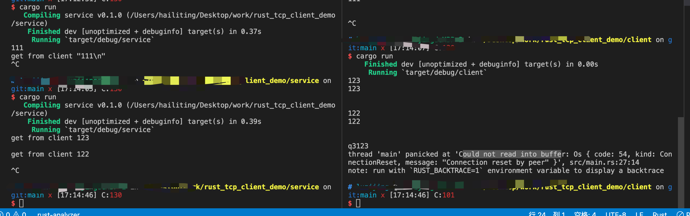

# rust tcp client demo



## `std::net`

### TcpStream

### TcpListener

一个 Tcp Socket 服务器，监听到该端口的任何连接

```rs
// 导入TcpListener结构
use std::net::TcpListener;

// 设置监听地址和端口
const LOCAL_HOST: &str = "127.0.0.1:8080";
// 创建 TcpListener
let listener = TcpListener.bind(LOCAL_HOST).expect("Failed to create TcpListener");
// 将监听器设置为非阻塞模式
listener.set_nonblocking(true).expect("Cannot set non-blocking");
```

### accept

```rs
let mut clients = vec![];
// 接受连接
if let Ok((mut socket, address)) = listener.accept() {
  // 向数组插入客户端字段
  clients.push(socket.try_clone()).expect("Failed to clone client");
}
```

```rs
pub fn accept(&self)-> Result<TcpStream, SocketAddr>
```

#### `bind()`和`set_nonblocking()`方法

```rs
// 返回一个可以连接的TCP监听器
pub fn bind<A:ToSocketAddrs>(addr: A)-> Result<TcpListener>
// 将 TCP 流设置为阻塞或非阻塞模式
pub fn set_nonblocking(&self, nonblocking:bool)-> Result<()>
```
