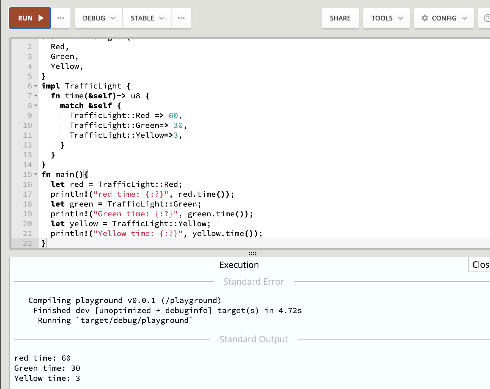
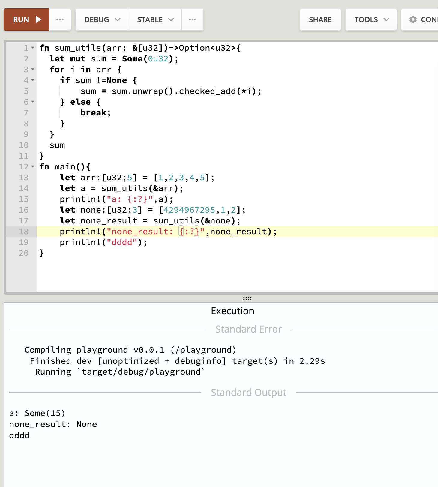
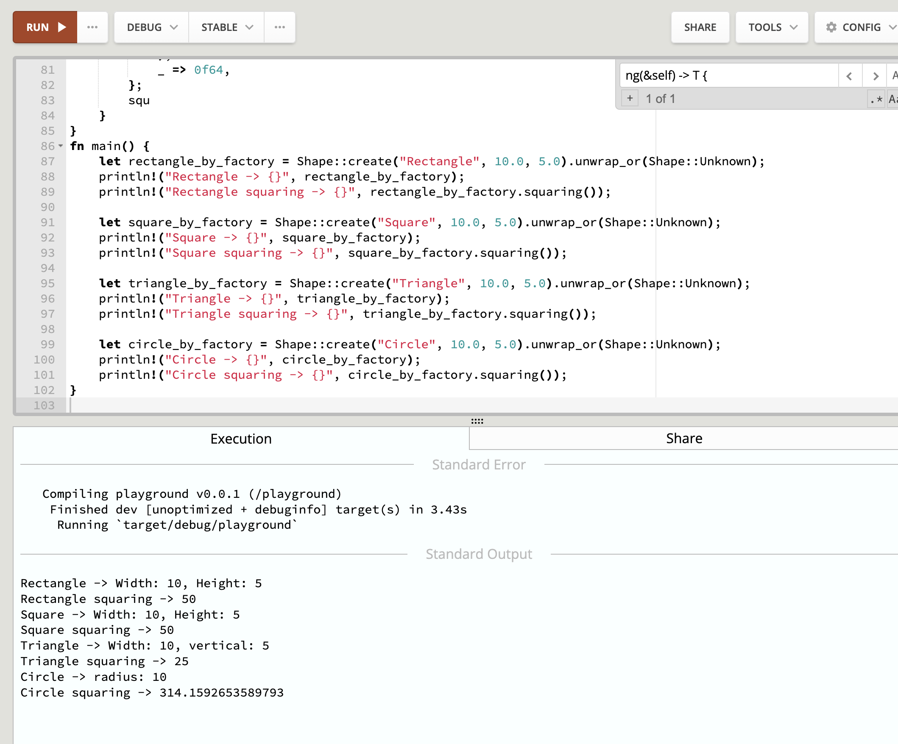

# 4

- 1. 为枚举交通信号灯实现一个 trait，trait 里包含一个返回时间的方法，不同的灯持续的时间不同；

```rs
enum TrafficLight {
  Red,
  Green,
  Yellow,
}
impl TrafficLight {
  fn time(&self)-> u8 {
    match &self {
      TrafficLight::Red => 60,
      TrafficLight::Green=> 30,
      TrafficLight::Yellow=>3,
    }
  }
}
fn main(){
  let red = TrafficLight::Red;
  println!("red time: {:?}", red.time());
  let green = TrafficLight::Green;
  println!("Green time: {:?}", green.time());
  let yellow = TrafficLight::Yellow;
  println!("Yellow time: {:?}", yellow.time());
}
```



- 2. 实现一个函数，为 u32 类型的整数集合求和，参数类型为 `&[u32]`，返回类型为 `Option<u32>`，溢出时返回 `None`；

```rs
fn sum_utils(arr: &[u32])->Option<u32>{
  let mut sum = Some(0u32);
  for i in arr {
    if sum != None {
        sum = sum.unwrap().checked_add(*i);
    } else {
        break;
    }
  }
  sum
}
fn main(){
    let arr:[u32;5] = [1,2,3,4,5];
    let a = sum_utils(&arr);
    println!("a: {:?}",a);
    let none:[u32;3] = [4294967295,1,2];
    let none_result = sum_utils(&none);
    println!("none_result: {:?}",none_result);
    println!("dddd");
}
```



- 3. 实现一个打印图形面积的函数，它接收一个可以计算面积的类型作为参数，比如圆形，三角形，正方形，需要用到泛型和泛型约束。

```rs
use std::f64::consts::PI;
use std::fmt;
pub trait ShapFn {
    fn squaring(&self) -> f64;
}
struct ShapeAttributes {
    width: f64,
    height: f64,
}
struct CircleAttributes {
    radius: f64, // 半径
}
struct TriangleAttributes {
    width: f64,
    vertical: f64, // 直径
}
enum Shape {
    Rectangle(ShapeAttributes),   // 长方形
    Square(ShapeAttributes),      // 正方形的
    Triangle(TriangleAttributes), // 三角形
    Circle(CircleAttributes),     // 圆圈
    Unknown,
}
impl Shape {
    fn create(shape: &str, size1: f64, size2: f64) -> Option<Shape> {
        match shape {
            "Rectangle" => Some(Shape::Rectangle(ShapeAttributes {
                width: size1,
                height: size2,
            })),
            "Square" => Some(Shape::Square(ShapeAttributes {
                width: size1,
                height: size2,
            })),
            "Triangle" => Some(Shape::Triangle(TriangleAttributes {
                width: size1,
                vertical: size2,
            })),
            "Circle" => Some(Shape::Circle(CircleAttributes { radius: size1 })),
            _ => None,
        }
    }
}

impl fmt::Display for Shape {
    fn fmt(&self, f: &mut fmt::Formatter<'_>) -> fmt::Result {
        let attrs = match self {
            Shape::Rectangle(shape_attrs) => format!(
                "Width: {}, Height: {}",
                shape_attrs.width, shape_attrs.height
            ),
            Shape::Square(shape_attrs) => format!(
                "Width: {}, Height: {}",
                shape_attrs.width, shape_attrs.height
            ),
            Shape::Triangle(shape_attrs) => format!(
                "Width: {}, vertical: {}",
                shape_attrs.width, shape_attrs.vertical
            ),
            Shape::Circle(shape_attrs) => format!("radius: {}", shape_attrs.radius),
            _ => format!("Width: Invalid, Height: Invalid"),
        };
        write!(f, "{}", attrs)
    }
}
impl ShapFn for Shape {
    fn squaring(&self) -> f64 {
        let squ = match self {
            Shape::Square(shape_attrs1) => (
               shape_attrs1.width * shape_attrs1.height
            ),
            Shape::Rectangle(shape_attrs) => (
               shape_attrs.width * shape_attrs.height
            ),
            Shape::Triangle(shape_attrs) => (
               shape_attrs.width * shape_attrs.vertical / 2.0
            ),
            Shape::Circle(shape_attrs) => (
               PI * shape_attrs.radius.powf(2.0)
            ),
            _ => 0f64,
        };
        squ
    }
}
fn main() {
    let rectangle_by_factory = Shape::create("Rectangle", 10.0, 5.0).unwrap_or(Shape::Unknown);
    println!("Rectangle -> {}", rectangle_by_factory);
    println!("Rectangle squaring -> {}", rectangle_by_factory.squaring());

    let square_by_factory = Shape::create("Square", 10.0, 5.0).unwrap_or(Shape::Unknown);
    println!("Square -> {}", square_by_factory);
    println!("Square squaring -> {}", square_by_factory.squaring());

    let triangle_by_factory = Shape::create("Triangle", 10.0, 5.0).unwrap_or(Shape::Unknown);
    println!("Triangle -> {}", triangle_by_factory);
    println!("Triangle squaring -> {}", triangle_by_factory.squaring());

    let circle_by_factory = Shape::create("Circle", 10.0, 5.0).unwrap_or(Shape::Unknown);
    println!("Circle -> {}", circle_by_factory);
    println!("Circle squaring -> {}", circle_by_factory.squaring());
}
```


