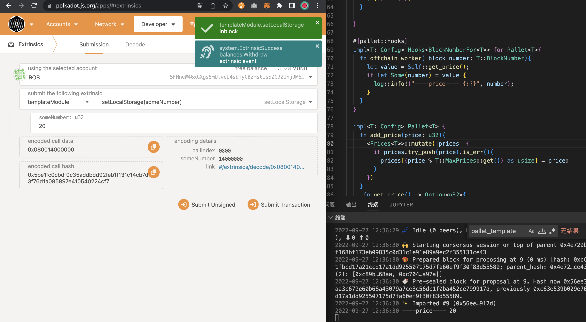
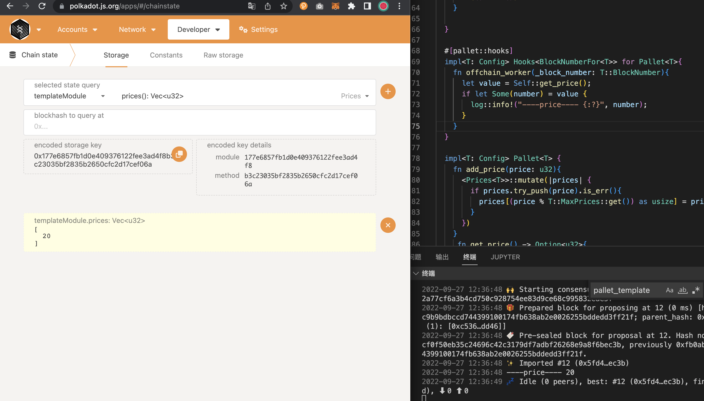

# v2-class04

- 在 Offchain Worker 中，使用 Offchain Indexing 特性实现从链上向 Offchain Storage 中写入数据
  
- 使用 js sdk 从浏览器 frontend 获取到前面写入 Offchain Storage 的数据
  
- 回答链上随机数（如前面 Kitties 示例中）与链下随机数的区别

  - 链上随机数：一般采用公开信息（当前节点之前的 81 个 block 哈市生成）,所以是个伪随机数，由于链上系统无法实现真正的不可预测的熵来保证生成随机数的随机性，所以链上的随机数 pallet 只推荐在 test 时使用
  - 链下的随机数：一般采用第三方提供的随机数，通过一个可信的 Oracle 来提供独立的随机数源

<!-- - 4. 在 Offchain Worker 中，解决向链上发起不签名请求时剩下的那个错误，参考： https://github.com/paritytech/substrate/blob/master/frame/example/offchain-worker/src/lib.rs
- 5. 构思一个应用场景，描述如何使用 Offchain Features 三大组件去实现它

  dome  todo
  https://github.com/paritytech/substrate/blob/master/frame/examples/offchain-worker/src/tests.rs -->
