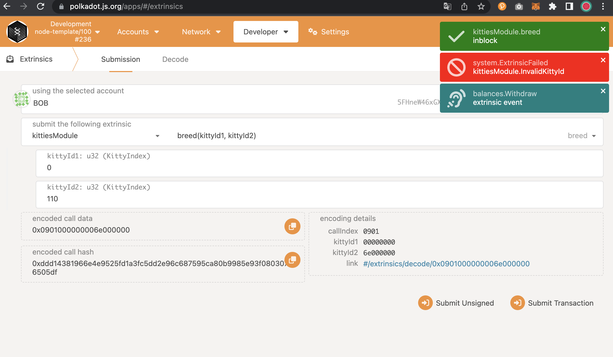

# Substrate Node Template v2_class02

## create

create_before

create_after

create_NoEnoughBalance

## bread

bread_before

bread_after

bread_InvalidKittyId

bread_NoEnoughBalance

bread_NotOwner

bread_SameKittyId

# transfer

transfer_before

transfer_after

transfer_InvalidKittyId

transfer_NotForSale

transfer_NotOwner

## sell

sell_before

sell_after

sell_NotOwner

## buy

buy_before_ALICE_STASH

buy_after_ALICE_STASH

buy_after_ALICE

buy_NoEnoughBalance

